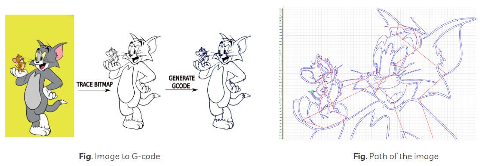
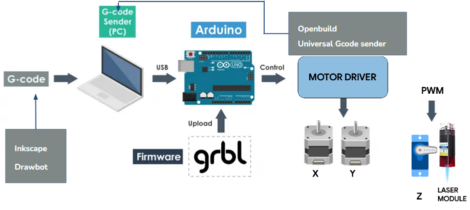

# Picasso - Wall Art Robot

This is a project which aims at developing a smart wall art robot that can take your picture to the wall. You can customise your wall in any way.

Digital            |  Plot on paper
:-------------------------:|:-------------------------:
  |  

## Maintainers
1.Adithya Krishna   https://github.com/Adithya2000-glitch   
2.Gopikrishnan TC  https://github.com/gktc  
3.Steena Xavier  https://github.com/SteenaXavier  
4.Vipin E https://github.com/vipinedayour
## Link to project walkthrough
https://drive.google.com/file/d/1reYak2XWaveg310bacjXTmTI0z7PpHS1/view?usp=sharing
## How it works?

Image-> Bitmap -> Gcode

## Technologies and Libraries used
Grbl  v1.1h https://github.com/grbl/grbl

DrawingBot V3 https://github.com/SonarSonic/DrawingBotV3

Inkscape https://inkscape.org/

## How to configure
**Block Diagram**

## How to run
## Improvements Required
## Follow us on
https://www.instagram.com/picasso_gect2023/
